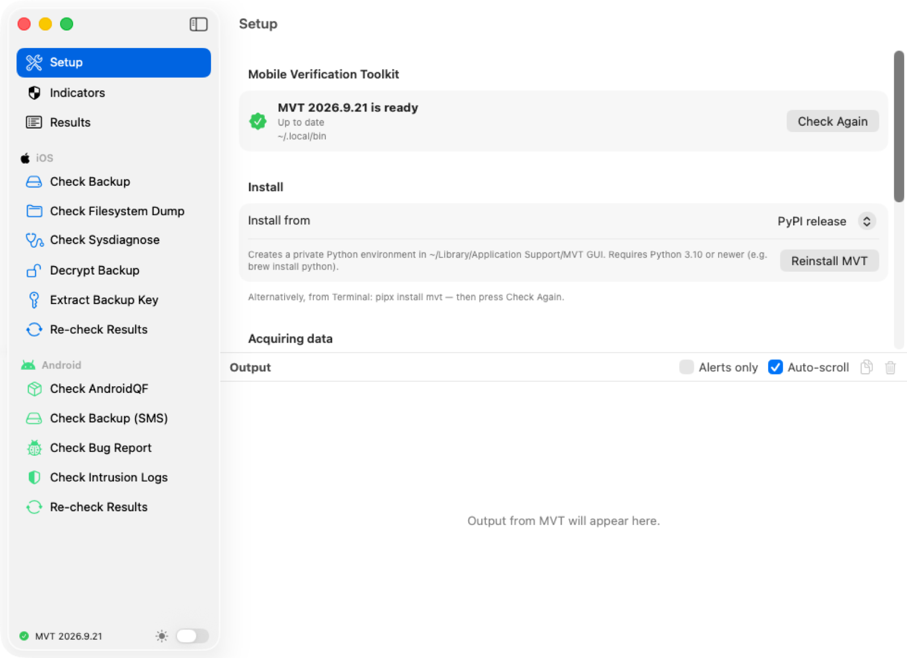
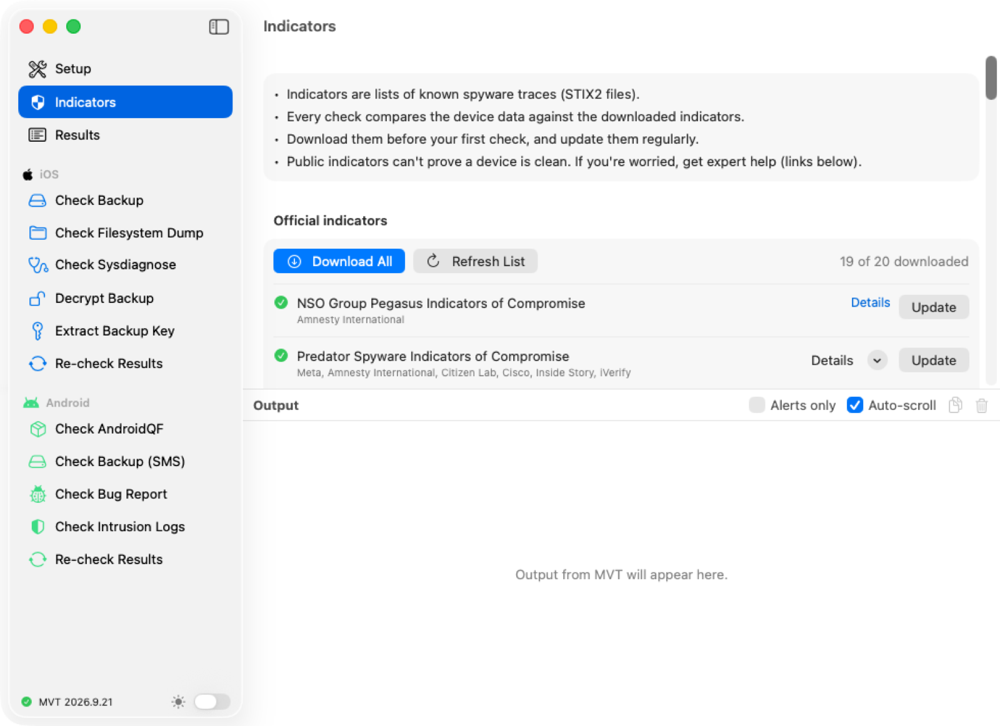
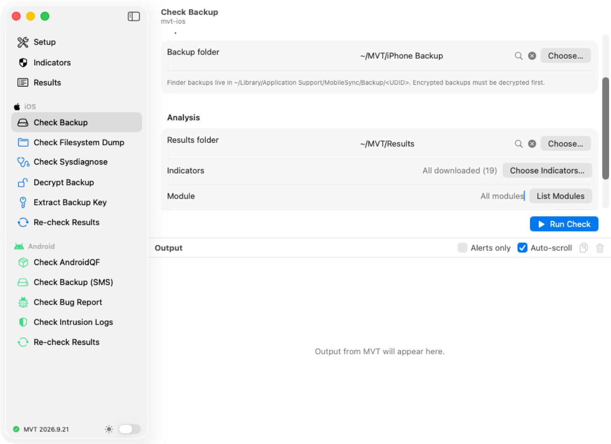
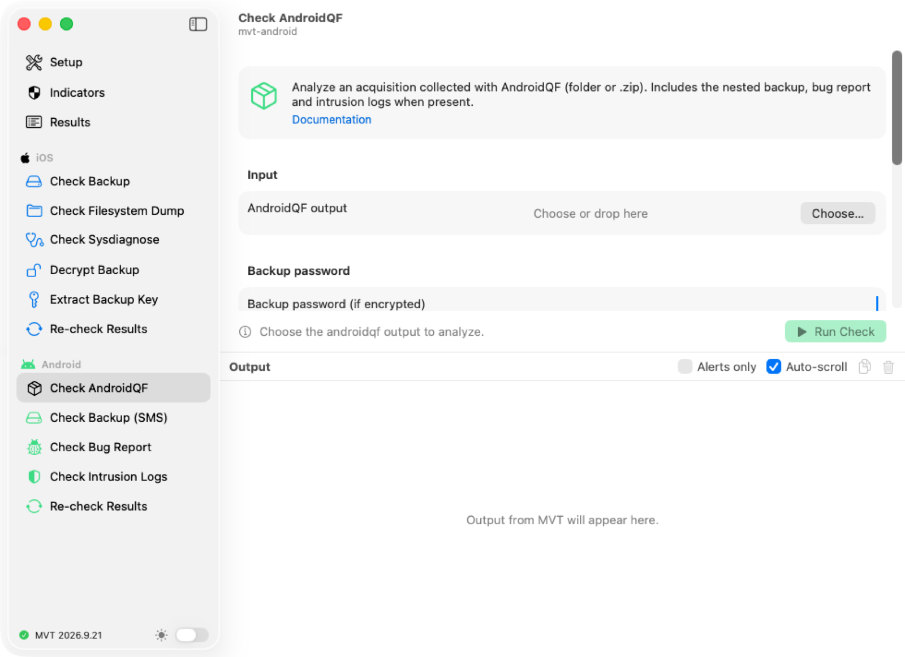
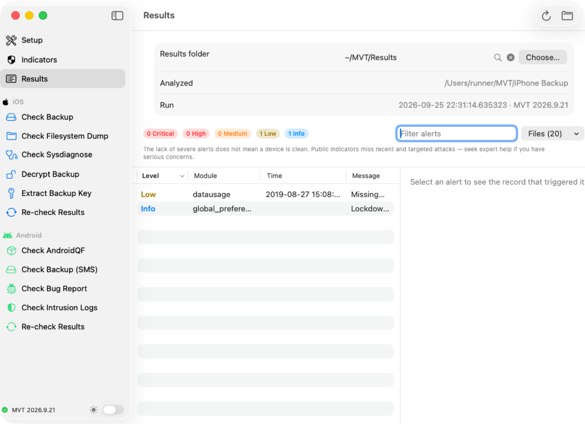

  

<h1 align="center">MVT Graphical UI</h1>

  Check iPhones and Android phones for traces of known spyware, without the Terminal!

  
  
  
  

**MVT GUI** is a simple app for the
[Mobile Verification Toolkit (MVT)](https://docs.mvt.re/) by Amnesty
International's Security Lab.

## Supported systems

| | System | Status | How |
|:-:|---|:-:|---|
|  | **Windows** 10 and 11 (64-bit) | ✅ | Portable app, MVT included ([see below](#windows)) |
|  | **macOS** 13 Ventura or newer | ✅ | Mac app ([Get the app](#get-the-app)) |
|  | **Linux** | ✅ | Run from source ([windows/README.md](windows/README.md#run-it-from-a-checkout)) |

  

## Get the app

1. Download the latest `MVT-GUI-…-macOS.zip` from
   [Releases](https://github.com/2B-4G10/MVT-GUI/releases).
2. Unzip it and move **MVTGUI.app** from the new folder to your
   **Applications** folder.
3. The first time only: right-click the app, choose **Open**, then **Open**
   again. The app isn't notarized by Apple.

You need macOS 13 Ventura or newer, and Python 3.10 or newer
(`brew install python`).

## Windows

There's also a portable app for Windows 10 and 11 (64-bit), with MVT
included:

1. Download the latest `MVT-for-Windows-….zip` from
   [Releases](https://github.com/2B-4G10/MVT-GUI/releases).
2. Unzip it into Documents, your Desktop or a USB drive.
3. Open the **MVT for Windows** folder and double-click
   **MVT for Windows.exe**. Nothing is installed, and no administrator
   rights are needed. To remove it, delete the folder.

The app starts through Python's own signed launcher, so Windows Security
and SmartScreen don't block it. MVT is already installed: skip **Install
MVT** below. When a newer MVT is out, **Setup** offers **Update MVT**.
Settings and indicators are kept in the folder's `Data` folder.

Everything else works as described below. On Windows, iPhone backups are
made with the **Apple Devices** app (or iTunes) and saved in
`%USERPROFILE%\Apple\MobileSync\Backup` or
`%APPDATA%\Apple Computer\MobileSync\Backup`. AndroidQF has a Windows
version. `README.txt` in the folder covers Smart App Control and
controlled folder access.

## Set it up (once)

1. Open **Setup** and press **Install MVT**.
   - If MVT is already installed, the app finds it.
   - If your MVT is out of date, press **Update MVT**.
2. Open **Indicators** and press **Download All**.

Indicators are lists of known spyware traces. The app downloads them from
the official sources:
[mvt-indicators](https://github.com/mvt-project/mvt-indicators),
[Amnesty International](https://github.com/AmnestyTech/investigations) and
[Echap's stalkerware indicators](https://github.com/AssoEchap/stalkerware-indicators).
Download them again from time to time to stay current.

## Check an iPhone

1. Connect the iPhone and open it in **Finder**.
2. Tick **Encrypt local backup**, set a password and press **Back Up Now**.
3. In the app, open **Decrypt Backup**:
   - **Backup folder:** the backup in
     `~/Library/Application Support/MobileSync/Backup/`
   - **Destination folder:** any empty folder
   - **Backup password:** the one from step 2
4. Press **Decrypt**, then **Check Decrypted Backup**.
5. Choose a **Results folder** and press **Run Check**.

## Check an Android phone

1. Collect the phone's data with
   [AndroidQF](https://github.com/mvt-project/androidqf).
2. In the app, open **Check AndroidQF** and choose AndroidQF's output
   folder.
3. Choose a **Results folder** and press **Run Check**.

## Read the results

1. Press **View Results** when the check finishes, or open **Results** and
   choose the results folder.
2. Alerts are sorted by severity: **Critical**, **High**, **Medium**,
   **Low**, **Info**.
3. Click an alert to see what triggered it.

> **No alerts doesn't mean a phone is clean.** Public indicators miss new
> and targeted attacks. If you're worried, get expert help from
> [Amnesty International's Security Lab](https://securitylab.amnesty.org/get-help/?c=mvt_docs)
> or [Access Now's Digital Security Helpline](https://www.accessnow.org/help/).

## Tips

- **Choose Indicators…** in any check lets you use all indicators, only the
  ones you pick, or your own STIX2 files.
- **Re-check Results** compares old results against newer indicators,
  without the phone.
- The switch at the bottom of the sidebar turns dark mode on or off.
  **Settings → Appearance** can also follow your Mac's setting.

## Support the project

If MVT for Mac helps you, you can show your love on
[Patreon](https://patreon.com/Dossary) ❤️

## License

MVT for Mac and MVT are released under the [MVT License 1.1](LICENSE),
which only allows checking a phone with the consent of its owner or user.
Credits for third-party artwork and trademarks are in [NOTICE](NOTICE).
